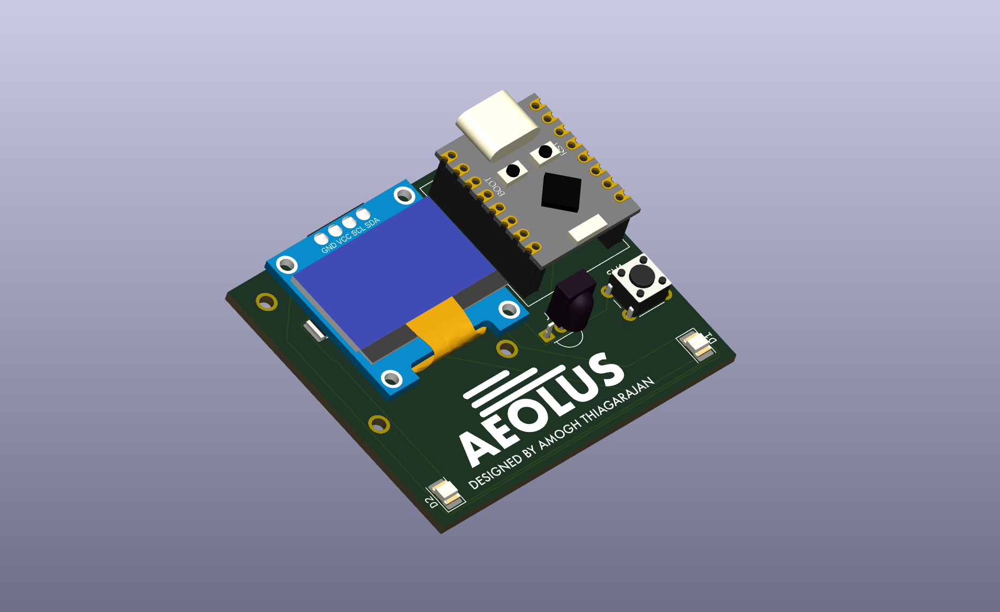
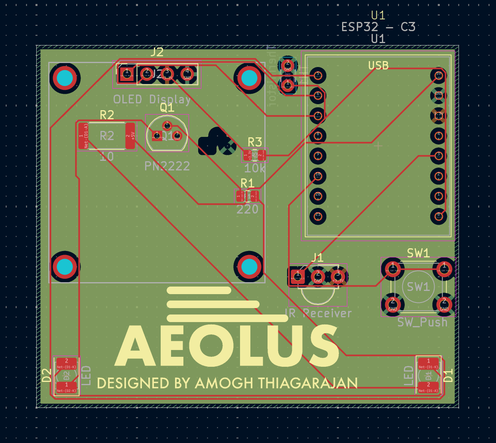
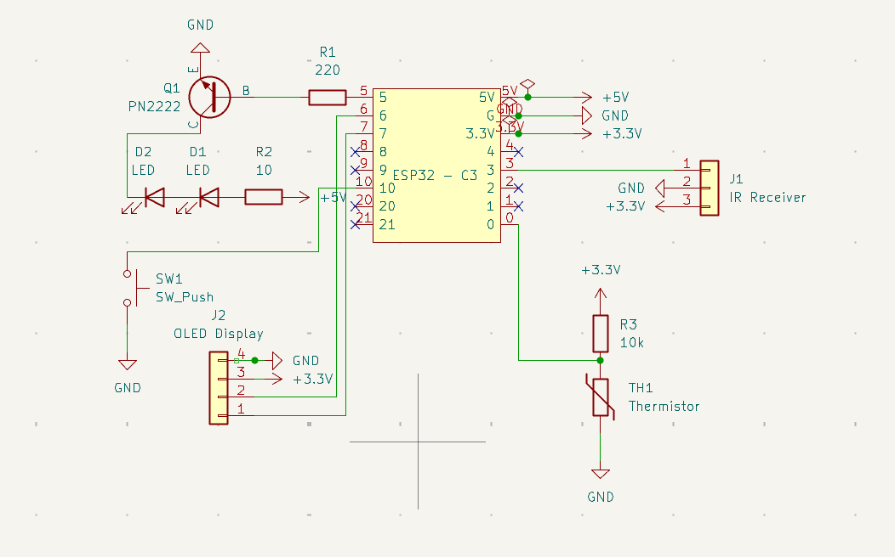

# Aeolus

**Aeolus** is a smart, temperature-aware IR fan controller built around an ESP32-C3. It watches room temperature and automatically turns a WOOZOO (or other NEC-protocol) fan on and off over infrared, with a 0.96" OLED status display, a physical control button, and an on-device IR "learn" mode for capturing new remote codes — all on a custom-designed 4-layer PCB.

Named after Aeolus, the keeper of the winds.

## Gallery

**3D render**



**PCB layout** (4-layer, black soldermask, silkscreen branding)



**Schematic**



## Background — this is v2 of my [fans](https://github.com/am0ghh/fans) project

Aeolus is a ground-up redesign of my earlier [dorm-room fan automation project](https://github.com/am0ghh/fans). The original ("fans") was an Arduino Uno R3 on a breadboard: a DHT11 sensor, an IR receiver, and a transistor-driven IR LED that automatically toggled the fan on hysteresis. It worked, but it was bulky, code-only, and limited to hardcoded remote codes.

Aeolus keeps the proven control logic and rebuilds everything around it as a real, compact, hardware product.

### Design improvements over v1 (`fans`)

| Area | v1 — `fans` | v2 — Aeolus |
|------|-------------|-------------|
| **Microcontroller** | Arduino Uno R3 (ATmega328P, 5V, large) | ESP32-C3 SuperMini (32-bit RISC-V, 3.3V, tiny, Wi-Fi/BLE capable) |
| **Temperature sensing** | DHT11 module (slow, ~1 Hz, NaN dropouts) | NTC thermistor read on the ADC with a Beta-equation conversion — faster, cheaper, no library timing quirks |
| **Display** | None (serial monitor only) | 0.96" SSD1306 I²C OLED with live temp/state readout and wind/snow animations |
| **User input** | None | Physical push button — single/double-tap for mode and manual control |
| **Remote codes** | Hardcoded in firmware | On-device IR **learn/scan mode** — capture a new remote's code without reflashing |
| **Build** | Breadboard / protoboard prototype | Custom **4-layer PCB** designed in KiCad (SIG–GND–PWR–SIG stackup), black soldermask, silkscreen branding |
| **Form factor** | Loose modules and jumper wires | Single integrated board with the OLED and modules socketed |

The transistor-buffered IR transmitter (the key range fix from v1 — extends usable range from ~1–2 ft to ~10–15 ft) is carried over into the Aeolus hardware.

## Hardware

- **ESP32-C3 SuperMini** microcontroller module
- **0.96" SSD1306 OLED** (I²C, address `0x3C`)
- **NTC thermistor** on the ADC for temperature sensing
- **IR receiver** (38 kHz demodulating, VS1838B-style) for learning remote codes
- **IR LED (940 nm)** transmitter, transistor-buffered for range
- **Momentary push button** for manual control / mode switching
- Custom 4-layer KiCad PCB (`hardware/Aeolus.kicad_pcb` / `.kicad_sch`)

### Pin map

| Function | ESP32-C3 GPIO |
|----------|---------------|
| IR transmit | GPIO5 |
| IR receive | GPIO3 |
| OLED SDA | GPIO7 |
| OLED SCL | GPIO6 |
| Button | GPIO10 |
| Thermistor (ADC) | GPIO0 |

## Firmware

The firmware lives in [`src/main.cpp`](src/main.cpp) and is built with PlatformIO (Arduino framework for ESP32-C3).

- **Automatic control with hysteresis** — fan turns on at 75 °F, off at 73 °F, so it won't rapidly cycle around the setpoint.
- **Minimum run time** — once the fan starts, it stays on for at least 10 minutes.
- **Two operating modes** — a normal run/monitor mode and a scan (IR-learn) mode, toggled from the button.
- **IR learn mode** — point your fan remote at the receiver and Aeolus captures the raw NEC code so it can replay it later.
- **OLED UI** — shows current temperature and fan state with animated wind (fan on) and snow (idle/cool) effects.
- Sends NEC-protocol IR commands (default is the WOOZOO fan power code).

### Build & flash

This is a [PlatformIO](https://platformio.org/) project:

```bash
pio run              # build
pio run -t upload    # flash to the ESP32-C3
pio device monitor   # serial output
```

Board and framework are configured in [`platformio.ini`](platformio.ini). Libraries used: IRremote, Adafruit SSD1306, Adafruit GFX.

## PCB & hardware design

The KiCad 9 project is in [`hardware/`](hardware/) (schematic, PCB, custom symbol/footprint libraries). Highlights:

- **4-layer stackup** (signal / ground plane / power plane / signal) — overkill for the node count, but clean power distribution and a good demonstration of multi-layer routing.
- **Custom ESP32-C3 SuperMini symbol and footprint**, pin-labeled to match the actual module.
- **Custom silkscreen branding** (the "Aeolus" wordmark) generated from the artwork in [`branding/`](branding/).
- 3D models for the ESP32-C3, OLED, and IR components in `hardware/Aeolus.3dshapes/` for a complete 3D render.

## License

See [LICENSE](LICENSE).
